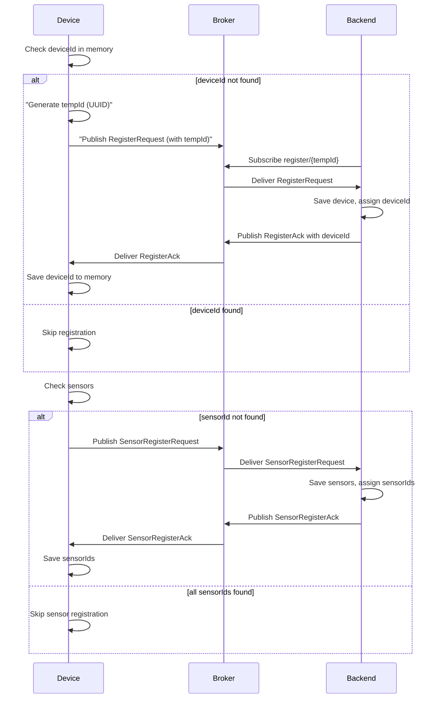

# Flow đăng ký device

## 1. Device khởi động và kiểm tra deviceId

* **Có `deviceId` trong bộ nhớ (flash/NVS):**
  → Dùng lại `deviceId`, bỏ qua bước đăng ký.

* **Không có `deviceId`:**

  * Tạo một **`tempId`** ngẫu nhiên (UUID v4 để tránh trùng).
  * Chuẩn bị payload theo `DeviceRegisterRequest` định nghĩa ở backend.
  * Publish tới topic:

    ```
    org/{orgId}/clusters/{clusterId}/register/{tempId}
    ```
  * Subscribe tới ACK topic:

    ```
    org/{orgId}/clusters/{clusterId}/register-ack/{tempId}
    ```
  * Chờ phản hồi từ backend.

    * Nếu **ACK thành công**: lấy `deviceId` từ payload, lưu xuống bộ nhớ.
    * Nếu **fail**: log lỗi và dừng.

## 2. Device kiểm tra danh sách sensors

* Device thường biết **capabilities** (ví dụ: có 3 sensor → temp, humidity, soil).
* Với mỗi sensor, check đã có `sensorId` được cấp chưa:

  * Nếu **chưa có**: tạo **payload register sensor** theo `SensorRegisterRequest`.

    * Gửi tới topic:

      ```
      org/{orgId}/clusters/{clusterId}/device/{deviceId}/sensors/register
      ```
    * Chờ ACK ở topic:

      ```
      org/{orgId}/clusters/{clusterId}/device/{deviceId}/sensors/register-ack
      ```
    * Lưu `sensorId` khi backend trả về.
  * Nếu **đã có** → bỏ qua.

---

# Payload định nghĩa

### DeviceRegisterRequest

```json
{
  "model": "ESP32-S3",
  "firmwareVersion": "1.0.0",
  "capabilities": {
    "sensors": ["temp", "humidity", "soil"],
    "actuators": ["pump"]
  }
}
```

### DeviceRegisterAck

```json
{
  "deviceId": "<device-uuid>",
  "assignedCluster": "<cluster-uuid>",
  "status": "registered"
}
```

### SensorRegisterRequest

```json
{
  "sensors": [
    { "tempKey": "temp", "type": "temperature" },
    { "tempKey": "hum", "type": "humidity" }
  ]
}
```

### SensorRegisterAck

```json
{
  "sensors": [
    { "tempKey": "temp", "sensorId": "sns_2001" },
    { "tempKey": "hum", "sensorId": "sns_2002" }
  ]
}
```

---

# Sequence Diagram (Mermaid)



---

 **Tóm lại**:

1. Device boot → check `deviceId`. Nếu chưa có → register qua `tempId`.
2. Backend cấp `deviceId`, trả về qua ACK.
3. Device lưu `deviceId`.
4. Device check `sensorId` cho từng sensor. Nếu chưa có → gửi register sensor → backend cấp `sensorId` → device lưu lại.

---

👉 Bạn có muốn mình viết luôn **mã giả lập device bằng Node.js** (dùng `mqtt.js`) cho flow này (bao gồm register device + register sensors) để chạy thử với EMQX không?
